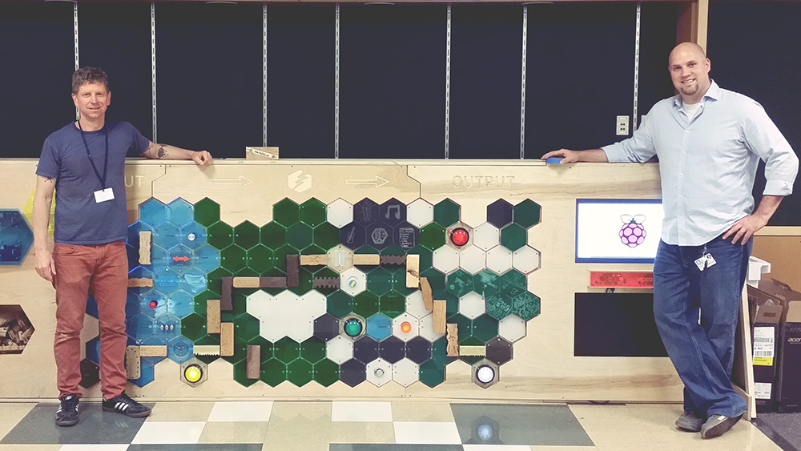

ForestParkSchoolWALL
====================

Forest Park School Interactive Wall 

The Wall occupies a trophy case in the halls at [Forest Park Elementary School](http://www.pps.k12.or.us/schools/forestpark/)

It is designed to be an attraction to introduce students to the ideas of circuits while providing entertainment.

[Wall Conceptual Design](documentation/Concept.md)
[2016 Board Electrical Redesign](documentation/Redesign.md)
[Programming the Wall](documentation/Programming.md)

